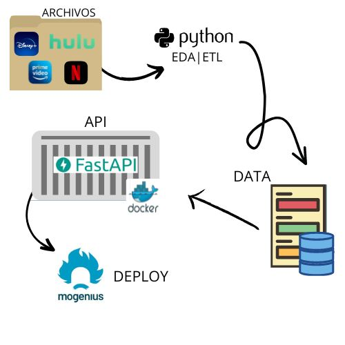

# Proyecto Individual #1 Facundo Martín Corengia | Bootcamp SoyHenry

---

## Índice

1. Introducción
2. Trabajo a realizar
3. Procedimiento
4. Conclusión

---

## Introducción

Hola, me llamo Facundo Martín Corengia. La finalidad de este repositorio es explicar mi Proyecto Individual del Bootcamp SoyHenry enfocado en la rama de Data Engineer.

---

## Trabajo a realizar

En este proyecto se realizará un proceso de ETL (Extracción, Transformación y Carga de datos) y posteriormente la creación de una API (Interfaz de Programación de Aplicaciones) con la librería FastApi, la misma debe encontrarse en un contenedor de Docker (un contenedor de Docker cuenta con todos los requerimientos para el perfecto funcionamiento de una aplicación, también es fácil de transportar de un equipo a otro). Esta API debe contar con la información otorgada por la academia. Esta información incluye tanto películas como series de cuatro plataformas de streaming, las cuales son: Netflix, Amazon Prime, Disney+ y Hulu. 

Después de la creación de la API, en la misma se debe consultar lo siguiente:

- Máxima duración según tipo de film (película/serie), por plataforma y por año: El request debe ser: get_max_duration(year, platform, min_or_season)
- Cantidad de películas y series (separado) por plataforma El request debe ser: get_count_plataform(platform)
- La plataforma en la cual se repite una mayor cantidad de veces un género y la cantidad. El request debe ser: get_listedin(genero). Como ejemplo de género pueden usar ‘Comedy', el cuál deberia devolverles un count de 2099 para la plataforma de Amazon Prime.
- Actor que más se repite según plataforma y año. El request debe ser: get_actor(platform, year).

---

## Procedimiento

Video explicativo de todo el proceso: https://www.youtube.com/watch?v=o5XN2bbH768&t=1s&ab_channel=FacundoCorengia

En primer lugar, importé las librerías Pandas (librería de Python especializada en la manipulación y el análisis de datos) y Numpy (librería que da soporte a una gran colección de funciones matemáticas de alto nivel, cuenta con una gran velocidad al estar escrito en su mayor parte en C). Luego realicé la carga de los datasets de Netflix, Amazon Prime, Hulu, y Disney+ con Pandas, los mismos datasets cuentan con información de tanto películas como series durante los años en las plataformas anteriormente mencionadas.

Luego, corroboré cuantos valores faltantes se encuentran en cada columna y dependiendo del tipo de datos que se encuentran en la misma, trabajé de una forma distinta. Siempre buscando la mejor calidad en los datos en cuestión, ya que cuento con una metodología de trabajo en la que busco no eliminar las tablas que tienen valores faltantes, ya que alguna de sus diversas filas pueden llegar a contar con información reelevante.

Durante el trabajo, surgieron diversos “problemas”, los cuales creo importante comentar. Las columnas ‘director’, ‘cast’, ‘country’ y ‘listed_in’ cuentan con valores separados por una “,” en vez de tener datos en distintas columnas, lo que dificulta las consultas hacia los datos que se encuentran en las mismas. Mi propuesta de resolución a este problema se basa en la utilización de la función strip() de Python (la función separa los datos por un carácter que se le especifique, en este caso la “,”), la misma junto a un ciclo for (una forma de recorrer las diversas columnas de valores en este proyecto) nos permite poder separar los datos que se encuentran separados por una “,” en las diversas columnas y después de eso poder utilizarlos tanto para las funciones requeridas como para consultar. 

Otras cuestiones a comentar son tanto la cantidad de valores faltantes en las distintas columnas como la gran cantidad de valores que no corresponden a las columnas en las que están ubicados, un ejemplo de esto es la columna ‘rating’ que contaba con datos que hacian referencia a la duración de una película o serie, cuando esta columna debería contar con datos que hagan entender al espectador si el contenido es apto para todo público o para mayores de una edad en determinada. El problema de valores faltantes fue solucionado con el método fillna() de Pandas, incorporando datos de otros datasets al que se está trabajando en ese momento. También, lo que se comentó de la columna ‘rating’ fue solucionado cambiando los valores que no corresponden por valores vacíos (NaN), esto debido a que es preferible la calidad de los datos a la cantidad.

Luego de sobrellevar los problemas y una vez realizado el ETL, se comenzó a trabajar en las funciones requeridas para la API. Estas funciones son:

- get_max_duration(year,platform,min_or_season)

Esta función se encarga de otorgarnos la película o serie con mayor duración por año y plataforma, los valores que puede tomar en el parámetro ‘year’ son de tipo entero, en el parámetro ‘platform’ podemos introducir cuatro valores: Netflix, Amazon Prime, Disney+ y Hulu y en el parámetro ‘min_or_season’ debemos introducir ‘min’ si queremos que nos otorgue resultados de películas y ‘season’ si queremos resultados de series.

- get_listedin(genero)

Esta función toma el parámetro ‘genero’ (este parámetro hace referencia a los distintos géneros de películas y series) que es de tipo string (o tipo texto). Si queremos buscar que género se encuentra mayor cantidad de veces en las diversas plataformas, debemos ingresar el nombre del género con la primera letra en mayúscula.

- get_count_plataform(platform)

Esta función toma el parámetro ‘platform’, en el cuál se debe insertar los valores de la plataforma de streaming que se requiera, las disponibles son: Netflix, Amazon Prime, Hulu o Disney+ (**con sus respectivas mayúsculas**) y nos va a otorgar la cantidad de películas y series (por separado) junto al nombre de la plataforma que se introdujo como parámetro.

- get_actor(platform,year)

Esta función toma dos parámetros, ‘platform’ (en el cuál debemos ingresar la plataforma de streaming de la cual queremos extraer los datos, las opciones son: Netflix, Amazon Prime, Hulu o Disney+ **con sus respectivas mayúsculas)** y ‘year’ (que hace referencia al año del que queremos conseguir la información) y nos da la información del actor que más veces apareció en tanto películas como en series en tanto la plataforma como el año seleccionado

Luego de completar el ETL y las funciones que se van a utilizar posteriormente en la API, debemos instalar tanto Docker como FastApi (también es recomendable instalar Docker Desktop). Una vez tenemos todo instalado debemos ejecutar la terminal de nuestra computadora y, una vez nos posicionamos en la carpeta donde tenemos todos los archivos de este repositorio debemos ejecutar el siguiente comando:

Con este comando creamos el contenedor de Docker con todo lo que necesitamos para el funcionamiento de la API. Luego de esto, debemos ejecutar el contenedor con el siguiente comando:

Una vez ejecutado el comando anterior, nos podemos dirigir a la API que se encuentra corriendo en nuestra computadora en el siguiente link [http://localhost/docs](http://localhost/docs).

Si aparece esto, significa que todo se instaló correctamente, y que se pueden probar todas las funciones oprimiendo en la que querramos, introduciendo los valores que se especificaron anteriormente cuando se habló del funcionamiento de las mismas. Pero también hay otra forma de acceder a esta API, y es mediante Mogenius en el siguiente link: [https://pi01-data05-prod-pi-facundo-corengia-kujp3w.mo4.mogenius.io/docs](https://pi01-data05-prod-pi-facundo-corengia-kujp3w.mo4.mogenius.io/docs).

Extra: Al momento de realizar el ETL, se crearon tablas de los valores únicos que se encuentran en las columnas ‘director’, ‘cast’, ‘country’ y ‘listed_in’, en caso de ser necesario para mejorar la API en un futuro.

---

## Conclusión

Creo que este proyecto esta bastante bien para poder asentar las bases del ETL en un entorno más “real”, también nos permite interactuar con herramientas como Docker, FastAPI y sobre todo Python y su libería Pandas. Es importante conocer todas estas herramientas ya que son muy utilizadas en el mercado.